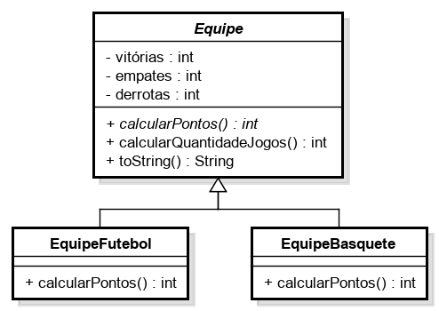

# Teste de Performance 2

Considere a seguinte estrutura de classes:

Uma clube de esporte possui dois tipos de equipes: equipe de basquete e equipe de futebol.

No campeonato de futebol, a vitória de uma equipe vale 3 pontos e o empate vale 1 ponto. No campeonato de basquete, a vitória vale 2 pontos e o empate 1 ponto. Em ambos os casos, não se soma pontos em caso de derrota.

1. Observando que a classe Equipe é abstrata, implemente-a em Java, encapsulando todos os atributos – tome o cuidado para validar os atributos.
2. O construtor deve ser parametrizado para receber os valores iniciais de todos os atributos.
3. Ainda na classe Equipe, implemente o método calcularQuantidadeJogos(), com base no número de vitórias, derrotas e empates. Além disso, defina o método abstrato calcularPontos().
4. Crie a classe EquipeFutebol observando que o método calcularPontos() deve respeitar as regras de negócio apresentadas no enunciado.
5. O construtor da classe EquipeFutebol deve ser parametrizado para receber os valores iniciais de todos os atributos.
6. Crie a classe EquipeBasquete observando que o método calcularPontos() deve respeitar as regras de negócio apresentadas no enunciado.
7. O construtor da classe EquipeBasquete deve ser parametrizado para receber os valores iniciais de todos os atributos.
8. Na classe Equipe, sobrescreva o método toString() de forma a retornar um texto formatado com os valores dos atributos.
9. Crie uma classe de teste chamada “Principal”, na qual sejam instanciados 04 equipes (2 de cada tipo) no método main, a partir de valores inseridos pelo operador.
10. Ainda no método main, verifique entre as duas equipes de futebol criadas, qual ficou a frente. Imprima somente a vencedora.